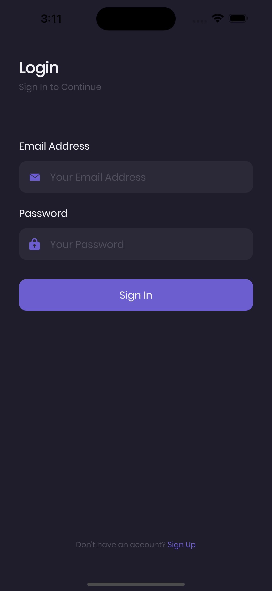
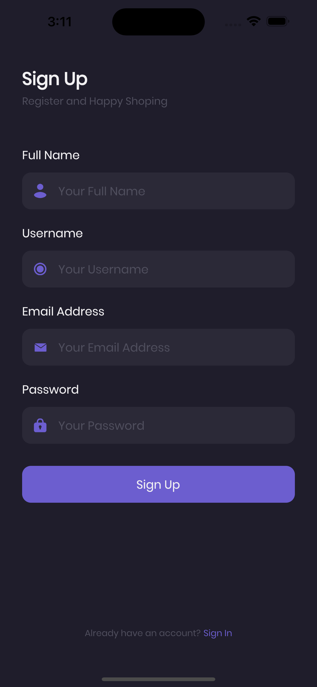
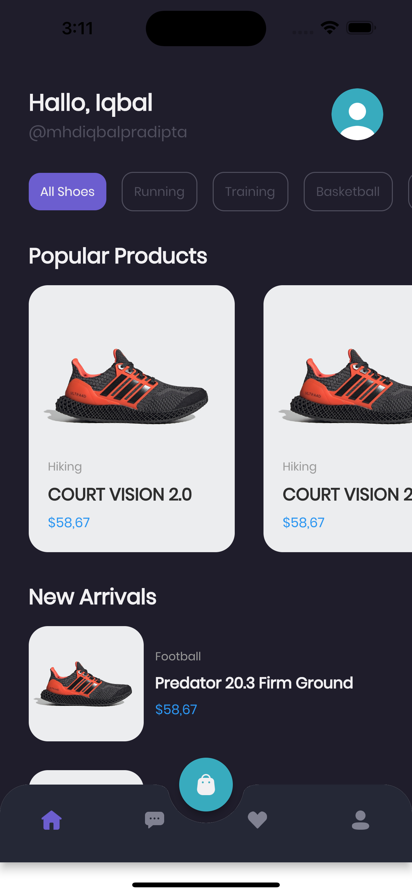
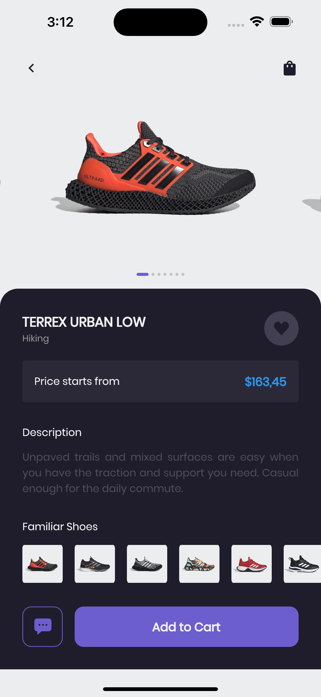
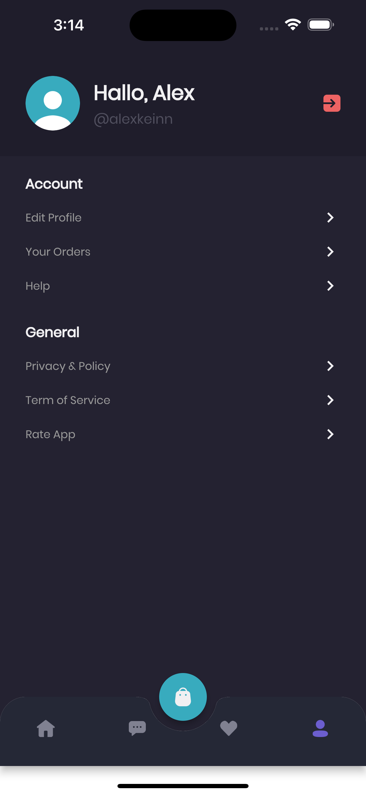
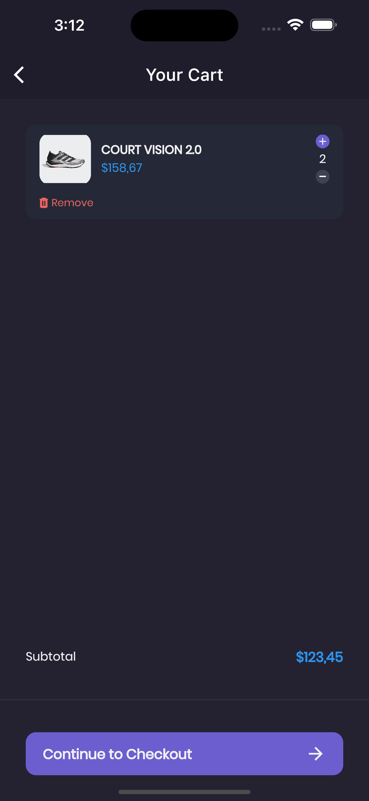
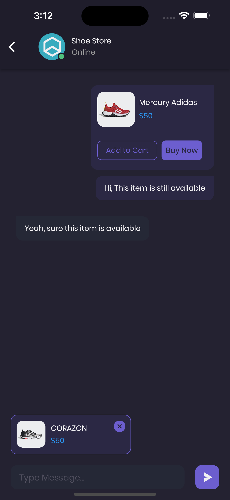
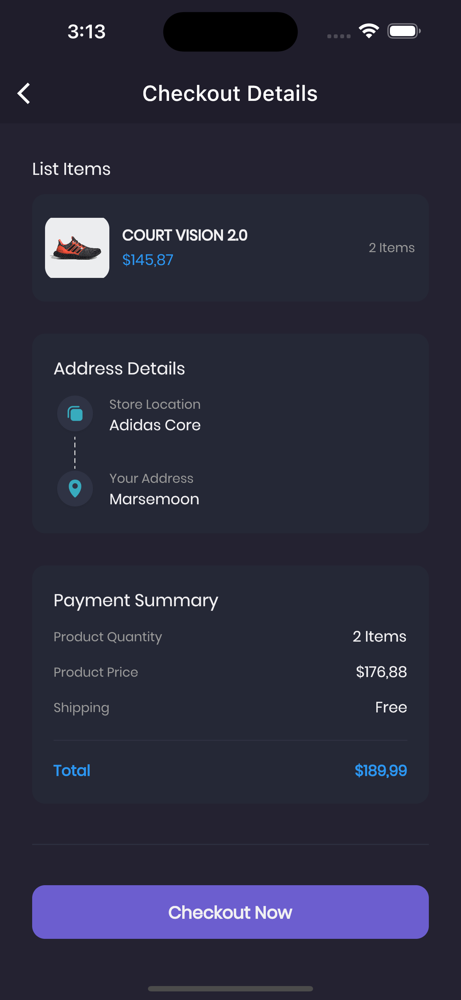
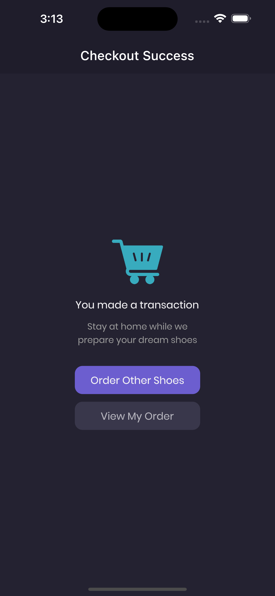

# flutter_ecommerce

Repository ini merupakan pembelajaran tampilan flutter, berikut tampilannya:

## Tampilan Login

<!--  -->

## Tampilan SignUp

<!--  -->

## Tampilan Home

<!--  -->

## Tampilan Details

<!--  -->

## Tampilan Profile

<!--  -->

## Tampilan SignUp

<!--  -->

## Tampilan Cart

<!--  -->

## Tampilan Chat

<!--  -->

## Tampilan Checkout

<!--  -->

## Tampilan Checkout Success

<!--  -->